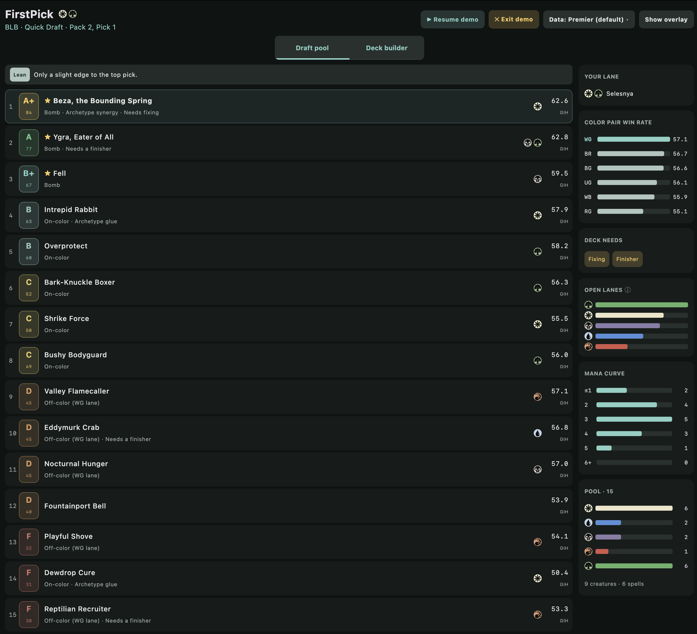
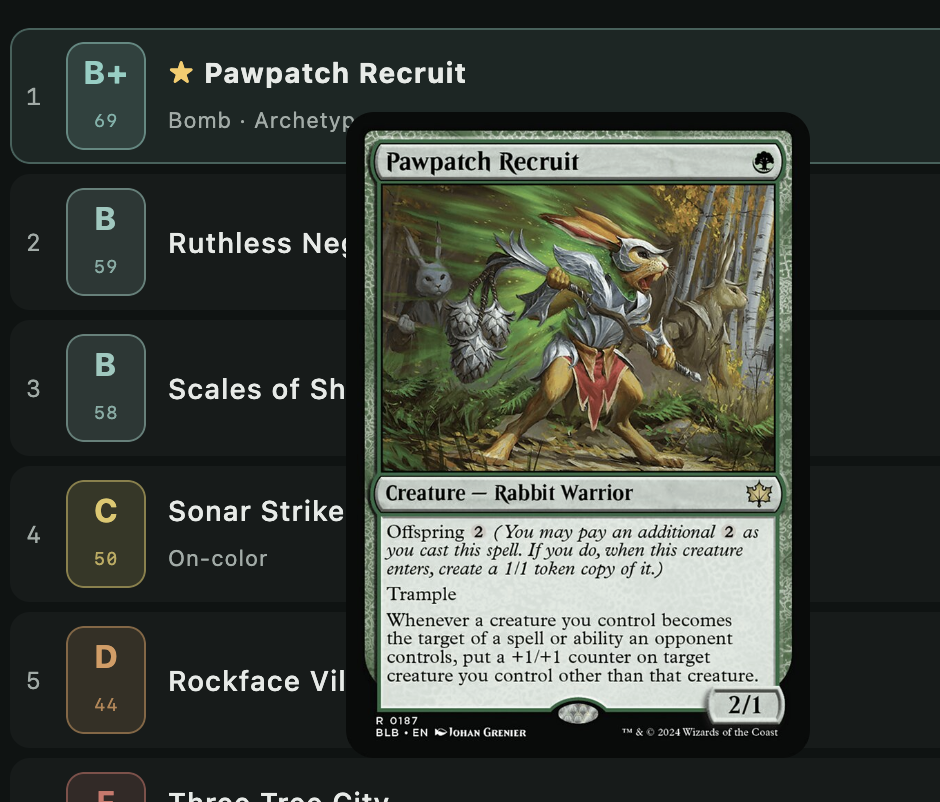
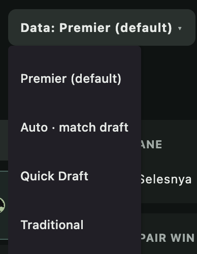
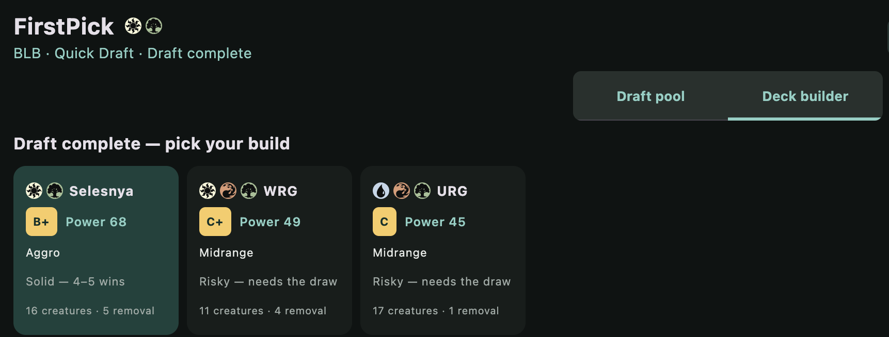
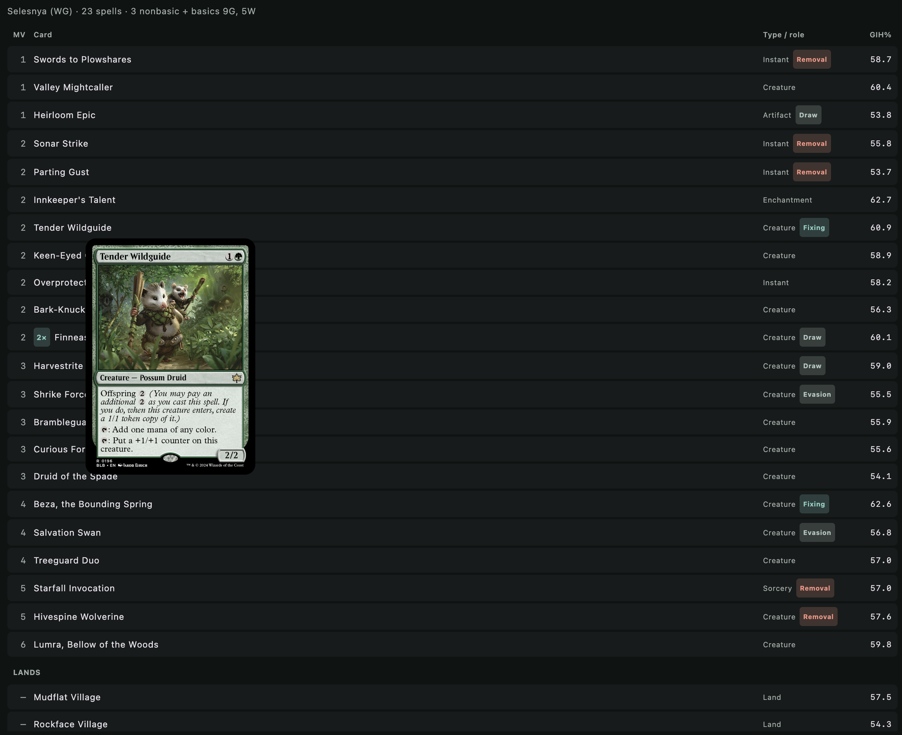

<p align="center">
  <picture>
    
  </picture>
</p>

<p align="center">
  A native macOS draft assistant for <b>Magic: The Gathering Arena</b>, built with Kotlin + Compose Multiplatform.
</p>

During a draft, FirstPick watches Arena's log, and for each pack it ranks the
cards by how good a **pick** they are — driven by [17Lands](https://www.17lands.com/)
win-rate data and adjusted for the deck you're actually building: your colors,
your archetype, your curve, and the roles your pool still needs. When the draft
ends, it proposes 2–3 finished decks with a power estimate.

> Unofficial fan project. Not affiliated with or endorsed by Wizards of the Coast.

<p align="center">
  <picture>
    
  </picture>
</p>

## Screenshots

**Live draft assistant.** Every card in the pack is graded **A+ → F** with a 0–100 value,
best pick on top, and a confidence banner when the call is close. The sidebar (above) tracks
your lane, the set's color-pair win rates, the roles your deck still needs, open lanes, your
mana curve, and your pool — all updating as you pick.

**Hover for the card.** Mouse over any card to see its full image while you read the ranking.

<picture>
  
</picture>

**Pick your data source.** Score from Premier, Quick, or Traditional 17Lands data — or
*Auto* to match the format you're drafting.

<picture>
  
</picture>

**Post-draft deck builder.** When the draft ends, get 2–3 buildable decks ranked by power,
each with a letter tier, archetype, and a win-rate outlook. It favors a clean two-color
build over a greedy splash.

<picture>
  
</picture>

**The full deck list.** Each build is laid out by mana value and WUBRG color, with role
tags (removal · fixing · finisher · draw · evasion), copy counts, and a suggested manabase.

<picture>
  
</picture>

## What it does

- **Live pack ranking** — every card scored 0–100 (`VALUE`), best pick on top,
  updating as you draft.
- **Archetype gravity** — knows each set's strong color-pair archetypes (17Lands
  pair win rates) and blends a card's global win rate with its win rate *in your
  colors*, weighting the archetype more as the draft commits. Cards that
  overperform in your pair get a synergy/glue bonus.
- **Smart lane detection** — your lane is the best color pair given both your
  picks and the set's archetypes: strong archetypes guide an open early draft,
  your actual picks take over later.
- **Dynamic deck-needs** — tracks removal, creatures, 2-drops, fixing, and
  finishers; nudges cards that fill gaps. The pressure ramps up through the draft,
  so early picks stay value-driven and late picks build a balanced deck.
- **At-a-glance dashboard** — your lane, ranked archetypes, open-lane signals,
  mana curve, pool, and current deck needs.
- **On-card overlay** — a transparent, click-through layer pinned to the Arena
  window that draws each card's grade (A+→F + 0–100) right on the card, locating
  them by screen capture so it stays aligned at any window size. Draft support
  only — no deck tracking.
- **Post-draft deck builder** — 2–3 buildable decks with power score, tier, type,
  manabase, and outlook.

## Requirements

- macOS (Apple Silicon or Intel)
- MTG Arena, with **Options → Account → Detailed Logs (Plugin Support)** enabled
- For the on-card overlay only: **Screen Recording** permission (System Settings →
  Privacy & Security → Screen Recording). macOS prompts on first use; FirstPick uses
  it solely to find where the cards are drawn — frames are analyzed in memory and
  never stored or sent anywhere. The rest of the app works without it.

## Download & install

Grab the latest `.dmg` from the [**Releases**](../../releases/latest) page:

- **Apple Silicon** (M1/M2/M3/M4 Macs): `FirstPick-<version>-arm64.dmg`
- **Intel** Macs: `FirstPick-<version>-x86_64.dmg`

> Not sure which? Apple menu  → **About This Mac** → look at "Chip" (Apple Silicon)
> vs "Processor" (Intel).

Open the `.dmg` and drag **FirstPick** into Applications. The app is **unsigned** —
it's a free, open-source project without a (paid) Apple Developer certificate — so on
first launch macOS will refuse to open it. To allow it, **either**:

- **System Settings → Privacy & Security**, scroll to the *"FirstPick was blocked…"*
  notice and click **Open Anyway**, then **Open** in the confirmation dialog; **or**
- run this once in Terminal:
  ```bash
  xattr -dr com.apple.quarantine "/Applications/FirstPick.app"
  ```

Then launch FirstPick, start a draft in Arena, and it updates live.

## Run from source

```bash
git clone https://github.com/francescolofranco-dev/first-pick firstpick && cd firstpick
./gradlew run     # needs a full JDK 21, e.g. brew install --cask temurin@21
```

Start a draft in Arena and FirstPick updates live.

## How it works

A coroutine pipeline: tail `~/Library/Logs/Wizards of the Coast/MTGA/Player.log`
→ reconstruct the live draft → fetch + cache 17Lands ratings, archetype data, and
Scryfall card facts → run the contextual advisor → render a Compose dashboard.
It only ever **reads** the log and your local MTGA card database — plus, when the
on-card overlay is on, screen frames of the Arena window analyzed in memory to
locate the cards. It never writes to Arena, and never stores or uploads frames.

See [CONTRIBUTING.md](CONTRIBUTING.md) for the architecture.

## Development

```bash
./gradlew run                  # launch the app (fastest; uses your dev JDK)
./gradlew test                 # unit tests
./gradlew createDistributable  # build a runnable FirstPick.app for local testing
./gradlew packageDmg           # build the macOS .dmg

# dev helpers (replay / inspect real logs)
./gradlew replay   -PlogPath="$HOME/Library/Logs/Wizards of the Coast/MTGA/Player.log"
./gradlew rankDemo -PlogPath="<log>" -Pstop="2:3"   # advisor output for a mid-draft pack
```

`createDistributable` writes `build/compose/binaries/main/app/FirstPick.app`
(`open` it or copy to /Applications). Packaging needs a **full** JDK that ships
`jpackage`; if your default JDK is an IDE's bundled JBR (which omits it), point
packaging at one:

```bash
./gradlew createDistributable -PcomposeJdk="$(/usr/libexec/java_home)"   # or set COMPOSE_JDK
```

Env vars: `FIRSTPICK_LOG=<path>` watches a custom log; `FIRSTPICK_FORCE_DECKS=1`
previews the deck builder mid-draft; `FIRSTPICK_SMOKE=1` opens then self-exits;
`FIRSTPICK_DEMO=1` shows the built-in demo-draft launcher (a dev aid that `./gradlew
run` sets automatically, and the packaged app omits).

Brand assets live in `packaging/icon/` (SVG source + `AppIcon.iconset`) and `docs/`
(banner, mark, social preview). Regenerate the `.icns` from the iconset with
`packaging/icon/build-icon.sh` (macOS only).

## Data sources & attribution

- Win-rate and archetype data from [17Lands](https://www.17lands.com/), licensed
  CC-BY-4.0. Fetched politely (cached, throttled, descriptive User-Agent).
- Card metadata, the `otag:removal` role tag, and the mana symbol SVGs in
  `src/main/resources/symbols/` from [Scryfall](https://scryfall.com/).
- Magic: The Gathering is © Wizards of the Coast. This is an unofficial fan tool.

## License

[MIT](LICENSE) © 2026 Francesco Lo Franco
